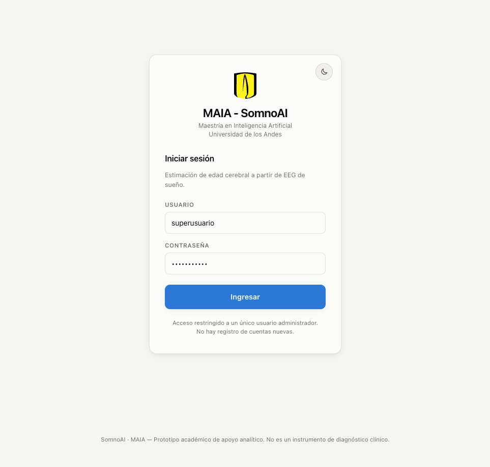

<!--
  Manual de usuario del tablero SomnoAI.
  Las capturas de pantalla se agregan en las marcas «[CAPTURA: ...]».
  Para insertarlas: reemplace cada marca por la imagen (arrastrándola en el editor
  de GitHub se genera automáticamente la etiqueta ,
  igual que en el manual de referencia).
-->

## SomnoAI - Manual de Usuario del Tablero

Esta aplicación permite cargar una polisomnografía nocturna (EEG de sueño) para
estimar la **edad cerebral** del sujeto y el **Brain Age Index (BAI)**, un
criterio automático de priorización para un especialista en sueño. Consta de
tres secciones:

1. Registros (vista principal / historial)
2. Analizar un nuevo registro
3. Resultados del análisis

**Nota**: Es importante hacer este proceso de forma secuencial para garantizar
su funcionamiento: primero se inicia sesión, luego se carga y analiza un
registro, y por último se consultan sus resultados desde el historial.

**Nota**: Este manual asume que la API y el tablero ya están en ejecución
(`http://localhost:8000` y `http://localhost:8080`, o las URL del despliegue
del equipo). Ver `README.md` para las instrucciones de instalación y arranque.

---

## 0. Inicio de sesión

La aplicación tiene un único usuario administrador; no hay registro de cuentas
nuevas.

### Paso 1. Acceder a la aplicación

Abra la URL del tablero en el navegador. Se muestra la pantalla de inicio de
sesión con el nombre del proyecto.

---

### Paso 2. Ingresar credenciales

Ingrese el **usuario** y la **contraseña** en los campos correspondientes.
Ambos campos vienen prediligenciados con las credenciales del prototipo:
**superusuario / somnoai2026**.

[CAPTURA: campos de usuario y contraseña completos]

---

### Paso 3. Confirmar acceso

Haga clic en **Ingresar**. Si las credenciales son correctas, se abre la vista
**Registros**. Si son incorrectas, se muestra un mensaje de error debajo del
formulario y la sesión no se inicia.

[CAPTURA: vista Registros tras iniciar sesión]

### Fin inicio de sesión

Con la sesión iniciada, se puede pasar a analizar un nuevo registro o a
consultar el historial existente.

---

## 1. Registros (vista principal)

La funcionalidad **Registros** muestra el historial de todos los análisis
realizados y un resumen general del comportamiento del BAI en la población
analizada.

### Paso 1. Acceder a la sección

Desde la barra de navegación superior, seleccione la pestaña **Registros**
(es la vista con la que se abre la aplicación después de iniciar sesión).

[CAPTURA: barra de navegación con la pestaña Registros seleccionada]

---

### Paso 2. Revisar los indicadores generales

En la parte superior se muestran cuatro indicadores: **registros
analizados**, **registros sobre el umbral** (|BAI| mayor a 10 años),
**divergencia mediana** del BAI y **fecha del último análisis**.

[CAPTURA: fila de indicadores (tiles) en la parte superior de Registros]

---

### Paso 3. Revisar la distribución del BAI

El panel **Distribución del BAI** muestra un punto por cada registro
analizado; la zona sombreada marca el umbral de priorización de ±10 años.

[CAPTURA: gráfico de distribución del BAI]

**Nota:** al pasar el mouse sobre un punto se muestra el detalle del registro
correspondiente.

---

### Paso 4. Consultar el historial de análisis

La tabla **Historial de análisis** lista cada registro guardado con sujeto,
archivo, fecha, edad real, edad cerebral, BAI y estado (**En rango** o
**Priorizar**).

[CAPTURA: tabla de historial de análisis]

---

### Paso 5. Filtrar y buscar registros

Use los botones **Todos** / **Sobre el umbral** para filtrar la tabla, o el
cuadro de búsqueda para filtrar por sujeto o nombre de archivo.

[CAPTURA: filtros y cuadro de búsqueda sobre la tabla]

---

### Paso 6. Abrir un registro existente

Haga clic en cualquier fila de la tabla (o en la flecha **→** al final de la
fila) para abrir el detalle de ese análisis en la vista **Resultados**.

[CAPTURA: fila de la tabla resaltada al pasar el mouse]

---

### Paso 7. Borrar un registro

Haga clic en el ícono de papelera al final de una fila para eliminar ese
análisis. Se abre un cuadro de confirmación con los datos del registro; haga
clic en **Borrar registro** para confirmar o en **Cancelar** para volver
atrás. Esta acción no se puede deshacer.

[CAPTURA: modal de confirmación de borrado]

### Fin de Registros

Desde esta vista se puede pasar a analizar un nuevo registro con el botón
**+ Analizar nuevo**.

---

## 2. Analizar un nuevo registro

La funcionalidad **Analizar nuevo** permite subir una polisomnografía para
procesarla y obtener la estimación de edad cerebral.

### Paso 1. Acceder a la sección

Desde la barra de navegación superior, seleccione la pestaña **Analizar
nuevo**, o el botón **+ Analizar nuevo** en la vista Registros.

[CAPTURA: barra de navegación con la pestaña Analizar nuevo seleccionada]

---

### Paso 2. Cargar el archivo de polisomnografía

Arrastre el archivo al recuadro indicado o haga clic sobre él para buscarlo en
el equipo.

**Nota:** Los formatos permitidos son **.edf** (un solo canal PSG) o **.zip**
(con el par PSG + hipnograma), con un límite de **600 MB por archivo**.

[CAPTURA: recuadro de carga de archivo (drag & drop)]

Una vez seleccionado, el archivo aparece en una fila con su nombre y tamaño
mientras el navegador intenta detectar la edad y el sexo del sujeto desde el
encabezado del archivo.

[CAPTURA: fila con el archivo seleccionado y la edad/sexo detectados]

**Nota:** si el archivo no es un `.edf` o `.zip` válido, o supera el límite de
tamaño, se muestra un mensaje de error y la carga no continúa.

---

### Paso 3. (Opcional) Usar un registro de ejemplo del dataset

En el panel **O pruebe con un registro del dataset** hay tres noches
precargadas de Sleep-EDFx. Haga clic sobre cualquiera de ellas para analizarla
directamente, sin necesidad de subir un archivo propio.

[CAPTURA: panel con los tres registros de ejemplo]

---

### Paso 4. Ingresar la edad cronológica (opcional)

El campo **Edad cronológica** se completa automáticamente cuando el
encabezado del archivo trae ese dato. Si el archivo no la trae, o si se quiere
fijar otra edad, se puede escribir manualmente; la edad escrita tiene
prioridad sobre la detectada.

[CAPTURA: campo de edad cronológica con el valor detectado como sugerencia]

**Nota:** la edad cronológica **no** es una característica del modelo; solo se
usa para calcular el BAI. Si el archivo no incluye hipnograma, la
estadificación del sueño se estima automáticamente.

---

### Paso 5. Ejecutar el análisis

Cuando el archivo y la edad (detectada o ingresada) son válidos, se habilita
el botón **Analizar registro →**. Al hacer clic, se muestra el estado
**Analizando registro…** mientras la API procesa el archivo.

[CAPTURA: botón Analizar registro habilitado]

[CAPTURA: estado de carga durante el análisis]

### Fin análisis de un registro

Al finalizar el procesamiento, la aplicación abre automáticamente la vista
**Resultados** con el detalle del análisis.

---

## 3. Resultados del análisis

La vista **Resultados** presenta el detalle completo de un análisis: edad
cerebral, BAI, espectro frente a la norma de la edad, señal EEG navegable y
calidad del registro.

### Paso 1. Revisar el archivo analizado

En la parte superior se muestra el nombre del archivo, la fecha y hora del
análisis, y el sexo y la edad utilizados.

[CAPTURA: encabezado con el archivo analizado]

---

### Paso 2. Interpretar la edad cerebral y el BAI

El bloque principal muestra la **edad cerebral estimada** (con su intervalo de
predicción), la **edad cronológica** y el **Brain Age Index (BAI)**. Debajo se
muestra una escala visual y un mensaje que indica si el registro supera el
umbral de priorización de ±10 años.

[CAPTURA: bloque de edad cerebral, edad cronológica y BAI]

[CAPTURA: mensaje de alerta según el umbral de priorización]

---

### Paso 3. Comparar el espectro con la norma de la edad

El panel **Espectro frente a la norma de su edad** compara la potencia
espectral del EEG del sujeto (línea de color) contra el rango esperado para
sujetos de edad similar (banda gris), incluyendo el análisis del déficit de
husos de sueño.

[CAPTURA: gráfico de espectro comparado con la norma]

---

### Paso 4. Explorar la señal EEG

El panel **Señal EEG a lo largo de la noche** permite navegar la señal cruda
del canal Fpz-Cz con el estadio de sueño anotado de fondo.

- Use los botones de ventana (**30 s**, **2 min**, **30 min**, **2 h**) para
  cambiar la escala de tiempo visible.
- Use las flechas **←** / **→** para moverse entre ventanas.
- Haga clic sobre la barra inferior para saltar directamente a otro momento de
  la noche.

[CAPTURA: visor de señal EEG con la barra de navegación inferior]

**Nota:** el color de fondo indica el estadio de sueño (W, N1, N2, N3, REM);
la profundidad del azul sigue la profundidad del sueño.

---

### Paso 5. Revisar la calidad del registro

El panel **Calidad del registro** resume qué contiene el archivo original
(duración, frecuencia de muestreo, canales) y qué parte de ese registro
alimentó efectivamente al modelo (ventana de sueño, épocas NREM utilizables,
vigilia recortada, entre otros).

[CAPTURA: panel de calidad del registro con las dos columnas de detalle]

### Fin resultados del análisis

Desde esta vista se puede volver al historial con **← Volver a registros**, o
analizar otro registro con el botón **Analizar otro registro**.

---

## 4. Otras funciones

### Cambiar entre tema claro y oscuro

El botón circular junto al usuario (o en la esquina de la tarjeta de inicio de
sesión) alterna entre tema claro y oscuro. La preferencia queda guardada en el
navegador.

[CAPTURA: botón de cambio de tema]

### Cerrar sesión

El botón **Salir**, en la barra superior, cierra la sesión y regresa a la
pantalla de inicio de sesión.

[CAPTURA: botón Salir en la barra superior]
